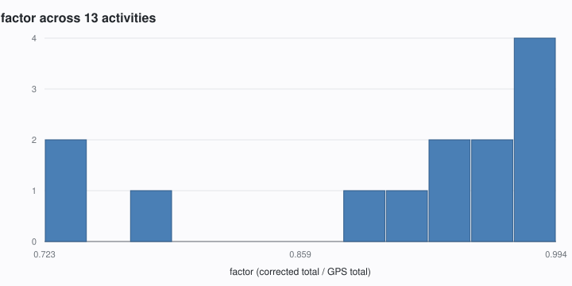

# Reckon

**Corrects Fitbit's GPS distance inflation before uploading to Strava.**


<!-- CI and coverage badges go here once the repository has a remote. They are
     deliberately omitted rather than pointed at a guessed URL. -->

## The problem

A wrist GPS records a noisy track. Every jitter in that noise *adds* length and
none subtracts, so summing the raw distance stream overstates how far you
actually went. Fitbit's own display avoids this by fusing GPS with stride
cadence — but the TCX export still carries the inflated stream, and Strava
believes it. The result is that the same run reads differently in two apps.

Real activities from a Fitbit Charge 5:

| Activity | Google Health shows | Strava shows | Inflation | Reckon produces |
|----------|--------------------:|-------------:|----------:|----------------:|
| run, 116 min | 21.46 km | 24.06 km | +12.1% | 21.46 km |
| run, 83 min | 15.23 km | 16.14 km | +6.0% | 15.23 km |
| run, 57 min | 8.18 km | 8.94 km | +9.3% | 8.18 km |
| walk, 24 min | 2.40 km | 2.54 km | +6.1% | 2.40 km |
| walk, 53 min | 5.26 km | 5.41 km | +3.0% | 5.26 km |
| walk, 67 min | 6.47 km | 6.54 km | +1.1% | 6.47 km |
| cycle, 30 min | 9.57 km | 9.76 km | +2.1% | 9.57 km |
| cycle, 31 min | 9.32 km | 9.37 km | +0.6% | 9.32 km |

Reckon rescales the distance stream so the total matches the device's own
figure, leaving the GPS geometry and every timestamp untouched.

The size of the correction is not fixed. Across twenty activities it ranged
from 0.6% to 38%, depending almost entirely on how noisy the track was:



## Quickstart

No credentials, no config, no network:

```console
$ git clone https://github.com/c10gdn-dev/reckon-tcx && cd reckon-tcx
$ uv run reckon rescale run.tcx -o fixed.tcx
reckon: 4747 trackpoints  gps 16148.9 m  target 15229.1 m (from file)  result 15229.1 m  factor 0.943045
```

Upload `fixed.tcx` to Strava by hand and the distance will match your watch.

Not on PyPI yet — the name `reckon-tcx` is reserved for when it is, at which
point that becomes `uv tool install reckon-tcx`.

> **Disable the native Fitbit→Strava connection first**, or the uncorrected
> version syncs itself and you get a duplicate.

## How it works

Fitbit and Strava disagree because they compute distance differently, and one of
them is summing noise.

**Strava sums the distance stream in the file, unchanged.** Verified across
twenty exports, and then tested directly: a rescaled file uploaded by hand came
back reporting the rescaled total, 21.4 km, where the original stream said
24.06 km and a raw haversine sum of the same coordinates said 24.08 km. Strava
takes the stream at face value and does not recompute from position.

It is not that Strava never post-processes. On the same upload it reported 179 m
of climb from an altitude stream whose raw deltas sum to 2279 m — it smooths
elevation by a factor of thirteen. It simply does not do that to distance, which
is what makes this correction possible.

**Fitbit's own total is lower, and it is not a raw GPS sum.** Fitbit writes it to
`Lap/DistanceMeters`, it matches what Google Health displays to within 0.06%, and
across the corpus it runs 0.6–12% below the stream.

How large the gap gets depends on what happened during the activity rather than
on how far you went. Standing still is the clearest case, because a stationary
receiver keeps inventing movement: two minutes of standing still added **119 m**
to a track that had not moved, and on a short walk an 81-second wait at a
crossing added **40 m**, which was 38% of that walk's whole over-measurement
while occupying 29% of its time.

Those two work out at 78 and 29 m per minute, and the gap between them is the
point: **the rate is not a property of the device**, it depends on the sky, the
buildings and the day. That is one of several reasons Reckon measures the
correction from the file in front of it rather than applying a rate.

The gap looks like high-frequency GPS noise. Sample a track at full resolution
and again at one fix per five seconds: real movement is smooth at that scale, so
the two lengths should agree, and the excess is jitter. That excess tracks the
Fitbit/Strava gap closely — a bike ride showed 2.5% excess against 2.1%
disagreement; the cleanest run 3.5% against 2.8%.

So Reckon takes **the total from Fitbit and the geometry from GPS**: compute
`factor = target / gps_total`, multiply every distance and distance-derived speed
value by it, and copy coordinates, altitudes and timestamps through unchanged.

> **On the name.** Reckon was named for dead reckoning, on the assumption that
> Fitbit's advantage came from fusing GPS with stride cadence. A bicycle ride
> disproved that — there are no strides on a bike, yet Fitbit's total still came
> in below the GPS stream, on both rides tested. Whatever Fitbit does, it is not
> primarily stride-based. The correction works regardless; it never depended on knowing why
> Fitbit's number is better.

## Honest limits

- **It corrects a systematic bias; it does not recover ground truth.** The
  output is as good as the device's own total and no better. Two watches carried
  along the same route at the same moment have disagreed by 28%, 7.3% and 6.6%
  in three tests, with nothing to say which was right. Step length differs
  between wearers and every device estimates it; that estimate is what you are
  trusting. Treat the result as much better than raw GPS, not as correct.
- **The correction is device-specific, and so is the problem.** On one route
  walked side by side, one watch over-measured by 38% and the other by 16%. Their
  raw GPS totals were 249 m apart on a 900 m walk — five times the gap between
  their step-counted totals. Reckon reads the factor from each file, so this is
  handled automatically, but it does mean two people on one walk will still not
  match afterwards: each is corrected to its own watch.
- **Splits all shift proportionally.** Every kilometre gets the same factor, so
  the *shape* of your pace curve is preserved exactly, but Reckon cannot tell
  which specific kilometre carried the error.
- **The first few seconds are missing from the file, and nothing can recover
  them.** A watch takes 15–80 seconds to get a fix, and if you set off
  immediately, that ground is never recorded. Across testing this cost 34–152 m,
  or 0.3–6.1% of the activity. The corrected *total* is still right, because the
  device's own figure counts those metres — but they get spread across the part
  of the route that was recorded, so splits stretch very slightly. This is
  already true of the raw file; Reckon neither causes it nor repairs it.
- **Route, timestamps and dates are unchanged.** Strava's *elapsed* time is
  unaffected. Its *moving* time shifts by a few seconds — 24 s on a real upload
  where the distance changed by 10.8% — because Strava derives it from speed, and
  speed is distance over time.
- **Elevation is not corrected.** See below; this is deliberate.
- **The factor is not a constant.** Across twenty activities it ranged 0.72–0.99
  and tracked neither distance, duration nor pace. It depends on how noisy that
  particular track was. Reckon computes it per file and refuses to guess.
- **A partial GPS track cannot be corrected, and Reckon detects that and
  declines.** If the watch lost its lock for part of the activity, the stream
  covers less ground than you actually travelled, and scaling it up would
  attribute the missing distance to the part of the route that *was* recorded.
  Reckon checks two things: how much of the elapsed time carried a fix, and
  whether the activity's own total exceeds what GPS measured — which cannot
  happen from noise alone, since jitter only ever adds length. Either one refuses
  the correction. The file is still written out, unchanged.
- **Indoor activities are passed through**, not corrected and not dropped. With
  no GPS there is no inflation to remove, so the file is written out unchanged.
- **Reckon does not touch activity type.** It edits distances and speeds only;
  whatever decides whether Strava calls something a run, a ride or yoga is
  outside this tool and is left alone.

## Elevation is left alone, on purpose

The altitude stream in a Fitbit export is at least as noisy as the distance
stream. On one 21 km run its raw deltas sum to **2279 m** of climb, which is not
a plausible number for the route.

Reckon does not correct it, and that is a deliberate scope decision rather than
an omission:

- **There is no target to correct it against.** The distance fix works because
  the file already carries a trustworthy total in `Lap/DistanceMeters`. Nothing
  equivalent exists for elevation — Google Health does not report it at all — so
  there is no reference figure to rescale to. Correcting a number with nothing to
  check it against would be inventing one.
- **Strava already handles it, and handles it well.** On that same 21 km run
  Strava reported **179 m**, which is reasonable for the route. It smooths the
  altitude stream by roughly a factor of thirteen. That is a job it already does
  properly, with better data than this tool has.

So Reckon copies every `AltitudeMeters` value through byte-identically and leaves
the interpretation to Strava. The one visible consequence is that Strava's
elevation figure moves very slightly after a correction — 179 m to 177 m on that
upload. Reckon did not change the altitudes; Strava recomputed. Its smoothing
appears to operate over distance-based windows, so a shorter distance stream
nudges the result. The effect is about 1%, in a figure that was always an
estimate.

**This asymmetry is the whole opportunity.** Strava is perfectly willing to
post-process a stream it judges noisy — it does exactly that to elevation. It
simply does not do it to distance. That gap is where this tool lives.

## Usage

```
reckon rescale INPUT [--distance DIST] [-o OUTPUT]
               [--tolerance FLOAT] [--on-tolerance {abort,clamp,proceed}]
```

| Argument | Meaning |
|----------|---------|
| `INPUT` | TCX file to read. |
| `--distance DIST` | Override the target. `15.23km`, `9.46mi`, or a bare number meaning metres. Defaults to the file's own `Lap/DistanceMeters`. |
| `-o`, `--output` | Write here instead of stdout. |
| `--tolerance` | How far *below* 1 the factor may fall before the guard fires. Default `0.4`. The bound is asymmetric — see below. |
| `--on-tolerance` | `abort` (default), `clamp` to the tolerance bound, or `proceed` anyway. |

The report line goes to stderr and the file to stdout, so
`reckon rescale in.tcx > out.tcx` works and stays readable.

**Every activity comes out the other side.** Anything Reckon cannot correct is
written through byte-identically rather than dropped, so an indoor session still
reaches Strava — just with the numbers it came with. Running Reckon twice is a
no-op: the second pass computes a factor of exactly 1.

### Measuring a corpus

`reckon analyse` runs over a directory of exports and reports what they have in
common — how far the factor varies, how much of each activity GPS actually
covered, how noisy each track was, and how far the derived figures move when the
stream is rescaled.

```console
$ reckon analyse --corpus training-data/ --plot
file        sport      factor    infl  cover  gaps  wiggle   lead   lag  dMove
...
16 of 20 corrected
factor  0.7229-0.9943  mean 0.8974  stdev 0.0974
worst moving-time change  58s
skipped  no_gps  x3
skipped  partial_gps  x1
wrote docs/factor-distribution.svg
```

`--plot` writes a histogram as hand-emitted SVG. There is no plotting library
here; a histogram is a few dozen rectangles, and the zero-dependency property is
worth more than the convenience.

**Guards.** Reckon leaves an activity alone, with a warning naming the reason,
rather than fabricating data:

| Situation | What happens |
|-----------|--------------|
| No `Position` elements — an indoor activity | Passed through unchanged. There is no GPS inflation to remove. |
| No `DistanceMeters` in the stream, or a zero total | Passed through unchanged. Reckon will not invent a stream. |
| Partial GPS — the watch lost its lock for part of the activity | Passed through unchanged. Scaling would attribute the missing distance to the part of the route that *was* recorded. |
| A non-monotonic stream | Warns and proceeds; multiplication preserves ordering. |
| Part of the activity has no trackpoints at all | Warns and proceeds. The distance survives — the file joins the two ends with a straight line — but the shape of that stretch is gone, so splits across it are approximate. |
| A factor further below 1 than `--tolerance` | Aborts by default. The stream over-measured by more than jitter can explain, so the target is probably wrong. |
| A factor above 1 | The stream measured *short*, which jitter cannot cause. Treated as partial GPS when the target came from the file, or as a bad `--distance` when you supplied one. |

The bound is deliberately **asymmetric**. GPS noise only ever adds length, so a
factor below 1 is the normal case and can legitimately be large — one real walk
in testing measured 0.723, a 38% over-read. A factor above 1 means something
quite different and gets handled separately.

### Syncing to Strava

Two commands need credentials. Authorise each service once — this opens a URL,
you approve it, and paste the address bar back:

```console
$ python scripts/authorize.py google --credentials ~/Downloads/client_secret_*.json
$ python scripts/authorize.py strava --client-id ... --client-secret ...
```

Prefer `--credentials` with the JSON file Google Cloud gives you: a secret passed
as a command-line flag ends up in your shell history and in `ps` output. Both
write into the same store, so `reckon sync` picks them up with no further
configuration.

Setting Google Cloud up is genuinely fiddly, and its error messages are not
helpful. **[docs/setup-google-cloud.md](docs/setup-google-cloud.md) walks through
it click by click**, including the two places it goes wrong silently.

`sync` also needs the client ids and secrets in the environment — the same values
the AWS side will read from SSM:

```
RECKON_GOOGLE_CLIENT_ID   RECKON_GOOGLE_CLIENT_SECRET
RECKON_STRAVA_CLIENT_ID   RECKON_STRAVA_CLIENT_SECRET
```

```
reckon fetch ACTIVITY_ID [--raw] [-o OUTPUT] [--store PATH]
reckon sync [--since DATE] [--until DATE] [--dry-run] [--store PATH]
```

`fetch` downloads one activity and corrects it; `--raw` gives you Google's bytes
untouched, which is what you want when reporting a bug. `sync` walks every
activity in the window, uploads each one, and records what it did so a second run
does nothing. Start with `--dry-run`: it does everything except upload and
record, and prints what it would have done.

```console
$ reckon sync --since 2026-08-20 --dry-run
  8896720705  Morning Walk       uploaded         factor 0.9312  dry run
  8896720706  Yoga               passed_through   dry run: no_gps

  1 passed_through  1 uploaded
```

Each line is one activity: its id, its name, what happened, and why. A `=` in the
first column means the decision was already on record and nothing was done.

**`sync` exits non-zero only when something did not reach Strava.** A yoga session
uploaded without correction is a success; a file Reckon refused is not.

The store at `~/.config/reckon/store.json` holds both the OAuth tokens and the
record of what has been uploaded. It is created `0600` and re-chmodded on every
open, because it contains refresh tokens.

## Status

Alpha, and honest about it. The offline commands — `rescale` and `analyse` —
work and are validated against twenty real exports, including a hand upload to
Strava confirming it honours the corrected stream.

`reckon fetch` and `reckon sync` are built: authorise both services once, and
`sync` will correct each new activity and upload it to Strava, keeping a local
record so nothing is done twice. Activities come in from the **Google Health
API**, not the Fitbit Web API — Google retired the standalone Fitbit app, stopped
issuing Fitbit developer accounts, and the legacy Web API is deprecated as of
September 2026. See `PLAN.md` §8.

Two caveats worth stating plainly. **The online path has not yet been run against
the live APIs** — it is tested end to end against a fake transport, so the first
real run is where any wrong field name will show up. And there is no AWS
deployment yet, so `sync` is something you run yourself.

Activities Reckon cannot correct — yoga, an indoor walk, a track whose GPS
dropped out — are uploaded **unchanged** rather than skipped. Correcting is not a
precondition for reaching Strava.

### First-time setup

Google Cloud registration is genuinely fiddly and its error messages are poor.
Two of its failure modes are silent rather than loud: a missing location scope
gives you activities with no route and no error, and authorising the wrong Google
account works perfectly until the first request for data.

<details>
<summary><strong>What is involved</strong> (full walkthrough:
<a href="docs/setup-google-cloud.md">docs/setup-google-cloud.md</a>)</summary>

Roughly half an hour, once:

1. Enable the Google Health API in a new Google Cloud project. No billing account
   needed.
2. Set the consent screen to **External**, and add both scopes — activity **and**
   location.
3. Fill in the branding page. **Do not upload a logo**; it commits you to a review
   process you do not need.
4. Publish the app. This matters: an unpublished app issues permissions that
   expire after **seven days**. Publishing is not a public listing and needs no
   verification, but it does require a home page and privacy policy on a domain
   verified in Search Console — GitHub Pages is enough.
5. Create an OAuth client with `http://localhost:8721/callback` as the redirect,
   download the JSON, and run `scripts/authorize.py`.

</details>

## Running it on AWS

Optional, and only worth it if you want activities corrected without running a
command. Steady-state cost is pennies a month — a handful of Lambda invocations,
a nearly-empty DynamoDB table and an SQS queue that is idle almost all the time.

<details>
<summary><strong>Deploying</strong></summary>

```
Google Health ──POST──► Lambda receiver ──► SQS ──► Lambda worker ──► Strava
                        (Function URL)      +DLQ      │
                                                      └──► DynamoDB
```

The same pipeline the CLI runs. Only storage and trigger differ.

**Order matters.** The table starts empty, so registering the webhook before
migrating your tokens means the first notification reaches a worker with no
credentials.

1. **Deploy.**
   ```console
   $ cd deploy/terraform
   $ cp terraform.tfvars.example terraform.tfvars   # set alarm_email
   $ terraform init && terraform apply
   ```
2. **Put the secrets in.** Terraform creates five SSM parameters holding a
   placeholder and never touches their values again, so no secret enters
   Terraform state.
   ```console
   $ aws ssm put-parameter --name /reckon/google_client_secret \
       --type SecureString --overwrite --value "$SECRET"
   ```
   Repeat for `google_client_id`, `strava_client_id`, `strava_client_secret`,
   and `webhook_secret` — the last is a value you invent, and Google will send it
   back on every webhook.
3. **Migrate your tokens**, and the record of what you have already uploaded:
   ```console
   $ python scripts/migrate.py --table reckon
   ```
   Skip the second part and the first notification will re-process everything
   you have already synced. Strava would reject the duplicates, so nothing breaks
   — it just wastes your API budget and fills the log.
4. **Register the webhook.**
   ```console
   $ URL=$(terraform -chdir=deploy/terraform output -raw webhook_url)
   $ python scripts/subscribe.py create --url "$URL" --secret "$WEBHOOK_SECRET" \
       --credentials ~/Downloads/client_secret_*.json
   ```
   Google verifies the endpoint as it registers it, so `--secret` must match the
   `webhook_secret` parameter exactly.

**The Function URL has no AWS authentication**, and that is deliberate: Google
cannot sign requests with SigV4. The shared secret in the `Authorization` header
is the authentication, compared in constant time. The receiver does nothing but
authenticate, copy the body to a queue and return — it never trusts the
notification's contents, and the worker re-fetches everything from the API.

Two alarms email you when something needs a person: a message reaching the
dead-letter queue, which means an activity did not get to Strava; and the
authorisation lapsing, which needs `scripts/authorize.py` re-run and cannot be
automated.

**Teardown** is `terraform destroy`. The SSM parameters and their values go with
it.

</details>

## Alternatives

If you want a click-and-forget bridge rather than a correction tool: FitToStrava,
SyncMyTracks, Health Sync, RunGap. Note that tapiriik has no Fitbit connector.
None of these correct the inflation — that is the whole reason this exists.

## Contributing

`ARCHITECTURE.md` covers the source map, the invariants and why the design is
shaped as it is. Source comments also cite `PLAN.md`, the implementation plan and
calibration record; that file is kept out of the repository because its
calibration sections describe specific outings in more detail than a
specification needs. The invariants it fixes are all restated in
`ARCHITECTURE.md`.

`make check` runs what CI runs: `ruff` plus the suite at a 100% line-and-branch
coverage gate. The gate is not negotiable and was set on the first commit rather
than retrofitted.

## Licence

MIT. See [LICENSE](LICENSE).
