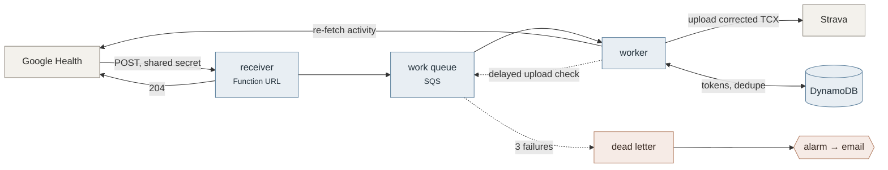

# Reckon

**Corrects Fitbit's GPS distance inflation before uploading to Strava.**

<!-- No badges, deliberately. They advertise a repository; this one is a tool. -->

## The problem

A wrist GPS records a noisy track. Every jitter in that noise *adds* length and
none subtracts, so summing the raw distance stream overstates how far you
actually went. Fitbit's own display avoids this by fusing GPS with stride
cadence — but the TCX export still carries the inflated stream, and Strava
believes it. The result is that the same run reads differently in two apps.

Real activities from a Fitbit Charge 5:

| Activity | Google Health shows | Strava shows | Inflation | Reckon produces |
|----------|--------------------:|-------------:|----------:|----------------:|
| run, 116 min | 21.46 km | 24.06 km | +12.1% | 21.46 km |
| run, 83 min | 15.23 km | 16.14 km | +6.0% | 15.23 km |
| run, 57 min | 8.18 km | 8.94 km | +9.3% | 8.18 km |
| walk, 24 min | 2.40 km | 2.54 km | +6.1% | 2.40 km |
| walk, 53 min | 5.26 km | 5.41 km | +3.0% | 5.26 km |
| walk, 67 min | 6.47 km | 6.54 km | +1.1% | 6.47 km |
| cycle, 30 min | 9.57 km | 9.76 km | +2.1% | 9.57 km |
| cycle, 31 min | 9.32 km | 9.37 km | +0.6% | 9.32 km |

Reckon rescales the distance stream so the total matches the device's own
figure, leaving the GPS geometry and every timestamp untouched.

The size of the correction is not fixed. Across twenty-six activities it ranged
from 0.6% to 38%. How noisy the track was is the best single predictor, though
only of the *order* — it ranks the corpus well and predicts the size of any
individual correction poorly, which is why Reckon measures every file rather than
estimating from one.

## Quickstart

No credentials, no config, no network:

```console
$ git clone https://github.com/c10gdn-dev/reckon-tcx && cd reckon-tcx
$ uv run reckon rescale run.tcx -o fixed.tcx
reckon: 4747 trackpoints  gps 16148.9 m  target 15229.1 m (from file)  result 15229.1 m  factor 0.943045
```

Upload `fixed.tcx` to Strava by hand and the distance will match your watch.

Not on PyPI yet — the name `reckon-tcx` is reserved for when it is, at which
point that becomes `uv tool install reckon-tcx`.

> **Disable the native Fitbit→Strava connection first**, or the uncorrected
> version syncs itself and you get a duplicate.

## How it works

Fitbit and Strava disagree because they compute distance differently, and one of
them is summing noise.

**Strava sums the distance stream in the file, unchanged.** Verified across
twenty-six exports, and then tested directly: a rescaled file uploaded by hand came
back reporting the rescaled total, 21.4 km, where the original stream said
24.06 km and a raw haversine sum of the same coordinates said 24.08 km. Strava
takes the stream at face value and does not recompute from position.

It is not that Strava never post-processes. On the same upload it reported 179 m
of climb from an altitude stream whose raw deltas sum to 2279 m — it smooths
elevation by a factor of thirteen. It simply does not do that to distance, which
is what makes this correction possible.

**Fitbit's own total is lower, and it is not a raw GPS sum.** Fitbit writes it to
`Lap/DistanceMeters`, it matches what Google Health displays to within 0.06%, and
across the corpus it runs 0.6–12% below the stream.

How large the gap gets depends on what happened during the activity rather than
on how far you went. Standing still is the clearest case, because a stationary
receiver keeps inventing movement. Five real stops were measured:

| Stopped for | Phantom distance |
|---|---:|
| 51 s | 18.0 m |
| 57 s | 18.3 m |
| 81 s | 39.6 m |
| 120 s | 119 m |
| 691 s | 62.9 m |

**The longest stop produced barely half what the two-minute one did**, so this is
not a rate and cannot be extrapolated. Measuring the 11.5-minute stop minute by
minute shows why: 16.8 m in the first minute, decaying to nothing by the sixth.
It is a front-loaded burst of roughly bounded size, and dividing it by an
ever-longer denominator is what makes short stops look like fast "rates".

How much a given stop costs still varies sixfold between them, which is one of
several reasons Reckon measures the correction from the file in front of it
rather than applying any rule.

The gap looks like high-frequency GPS noise. Sample a track at full resolution
and again at one fix per five seconds: real movement is smooth at that scale, so
the two lengths should agree, and the excess is jitter. That excess tracks the
Fitbit/Strava gap closely — a bike ride showed 2.5% excess against 2.1%
disagreement; the cleanest run 3.5% against 2.8%.

So Reckon takes **the total from Fitbit and the geometry from GPS**: compute
`factor = target / gps_total`, multiply every distance and distance-derived speed
value by it, and copy coordinates, altitudes and timestamps through unchanged.

> **On the name.** Reckon was named for dead reckoning, on the assumption that
> Fitbit's advantage came from fusing GPS with stride cadence. A bicycle ride
> disproved that — there are no strides on a bike, yet Fitbit's total still came
> in below the GPS stream, on both rides tested. Whatever Fitbit does, it is not
> primarily stride-based. The correction works regardless; it never depended on knowing why
> Fitbit's number is better.

## Honest limits

- **It corrects a systematic bias; it does not recover ground truth.** The
  output is as good as the device's own total and no better. Two watches carried
  along the same route at the same moment have disagreed by 28%, 7.3% and 6.6%
  in three tests, with nothing to say which was right. Step length differs
  between wearers and every device estimates it; that estimate is what you are
  trusting. Treat the result as much better than raw GPS, not as correct.
- **The correction is device-specific, and so is the problem.** On one route
  walked side by side, one watch over-measured by 38% and the other by 16%. Their
  raw GPS totals were 249 m apart on a walk their own step counts put at 809 and
  862 m — nearly five times the gap between those two figures. Reckon reads the factor from each file, so this is
  handled automatically, but it does mean two people on one walk will still not
  match afterwards: each is corrected to its own watch.
- **Splits all shift proportionally.** Every kilometre gets the same factor, so
  the *shape* of your pace curve is preserved exactly, but Reckon cannot tell
  which specific kilometre carried the error.
- **The start of the activity can be missing from the file, and nothing can
  recover it.** A watch takes time to find the sky, and if you set off
  immediately that ground is never recorded. Across the corpus this ran from 1 to
  85 seconds, costing roughly 2 to 339 metres.

  While the loss is small, the corrected *total* is still right — the device's
  own figure counts those metres — and they simply get spread over the part of
  the route that was recorded, stretching splits very slightly. Reckon neither
  causes that nor repairs it; it is already true of the raw file.

  **Past a point, spreading them is worse than not correcting**, so Reckon stops.
  If more than 5% of the activity's own duration has no track in it *and* the
  file's total exceeds what GPS measured, the activity is passed through
  uncorrected with the reason named. One real 9.5 km run recorded nothing for its
  first 365 seconds — about a kilometre — and would otherwise have had its
  remaining 8.6 km inflated by 10% to make up the difference.
- **Route, timestamps and dates are unchanged.** Strava's *elapsed* time is
  unaffected. Its *moving* time shifts by a few seconds — 24 s on a real upload
  where the distance changed by 10.8% — because Strava derives it from speed, and
  speed is distance over time.
- **Heart rate depends on which route you use.** Google Health's API exports a
  route, not a full recording: the same walk exported by hand from the app has
  heart rate on 193 of its trackpoints, and fetched through the API has none. So
  `reckon sync` cannot give you a heart-rate trace and `reckon local` can — the
  file you export yourself already contains one, and Reckon leaves it alone.

  **If you use Strava's Fitness score, this is the difference that matters.**
  Fitness is computed from Relative Effort, which needs heart-rate data or a
  Perceived Exertion you enter by hand. An activity with neither contributes
  nothing to it.

  Both halves of that are now measured rather than assumed. A 14 km run uploaded
  through `sync` carrying `Lap/AverageHeartRateBpm` of 140 produced **no**
  Relative Effort — Strava builds it from time spent in heart-rate zones, and a
  single average cannot supply that. The same activities uploaded through `local`
  from hand exports produced Relative Effort on **all** of them, including a yoga
  session and a weights session that have no GPS at all and previously counted for
  nothing.

  Reckon still writes the summary average onto the lap when it has one, because
  it costs nothing. It will not invent a per-trackpoint trace from an average: a
  flat line across your run would look like data and be nothing of the kind.

  There is a third route — fetching the per-second series from the API and
  merging it by timestamp — and the code for it exists. It needs a scope Google
  classes as *Restricted*, which a published app cannot hold without an annual
  paid security audit, and an unpublished one can hold only at the cost of a login
  that expires weekly. It is off by default and stays that way. It matters only
  for a fully automated pipeline, where nobody is there to export a file.
- **Elevation is not corrected.** See below; this is deliberate.
- **The factor is not a constant.** Across twenty-six activities it ranged 0.72–0.99
  and tracked neither distance, duration nor pace. It depends on how noisy that
  particular track was. Reckon computes it per file and refuses to guess.
- **A partial GPS track cannot be corrected, and Reckon detects that and
  declines.** If the watch lost its lock for part of the activity, the stream
  covers less ground than you actually travelled, and scaling it up would
  attribute the missing distance to the part of the route that *was* recorded.
  Reckon checks how much of the elapsed time carried a fix, and refuses below
  80%. It also refuses when the activity's own total exceeds what GPS measured
  **and** the track shows somewhere the route could have gone missing — a
  trackpoint without a fix, a stretch with no trackpoints at all, or a track that
  does not span the activity. Both halves are required: a complete track can
  measure slightly short all by itself,
  because the stream joins fixes with straight lines and a chord is shorter than
  the curve it cuts. A real 14 km run measured 0.6% short with every trackpoint
  carrying a fix and nothing missing at all. The file is still written out,
  unchanged.
- **Activities with no GPS are passed through**, not corrected and not dropped.
  With no GPS there is no inflation to remove, so the file is written out
  unchanged and your watch's own distance still reaches Strava.

  That covers more than indoor sessions. One activity in testing was a walk to a
  station followed by a train journey, entirely outdoors: the file carries no
  position at all, and 422 m of stride distance across several kilometres of
  ground. Passing it
  through is right, because the watch measured what you *did* rather than where
  you ended up. Had it held a fix on the train, the file would have claimed
  several kilometres of walking against a 422 m step count — and Reckon refuses
  that rather than picking one, because no single factor reconciles two totals
  that describe different journeys.
- **Reckon does not touch activity type.** It edits distances and speeds only;
  whatever decides whether Strava calls something a run, a ride or yoga is
  outside this tool and is left alone.

## Elevation is left alone, on purpose

The altitude stream in a Fitbit export is far noisier than the distance stream.
On a **2.22 km walk** the raw deltas sum to **1365 m** of climb — no 2 km walk
gains that, whatever the terrain. A 21 km run sums to 2279 m.

Those two are the point: the second figure is not ten times the first, though the
run is ten times longer. Across the corpus the raw climb bears little relation to
distance at all, running from 36 to 989 metres per kilometre with only a weak
tendency for shorter activities to score worse. Distance inflation is a
percentage of how far you went; this is not a percentage of anything.

Reckon does not correct it, and that is a deliberate scope decision rather than
an omission:

- **There is no target to correct it against.** The distance fix works because
  the file already carries a trustworthy total in `Lap/DistanceMeters`. Nothing
  equivalent exists for elevation — Google Health does not report it at all — so
  there is no reference figure to rescale to. Correcting a number with nothing to
  check it against would be inventing one.
- **Strava already handles it, and handles it well.** For the 21 km run — the one
  activity here with a Strava elevation figure recorded against it — Strava
  reported **179 m** against that raw 2279 m, which is reasonable for the route.
  It smooths the altitude stream by roughly a factor of thirteen. That is a job it
  already does properly, with better data than this tool has.

So Reckon copies every `AltitudeMeters` value through byte-identically and leaves
the interpretation to Strava. The one visible consequence is that Strava's
elevation figure moves very slightly after a correction — 179 m to 177 m on that
upload. Reckon did not change the altitudes; Strava recomputed. Its smoothing
appears to operate over distance-based windows, so a shorter distance stream
nudges the result. The effect is about 1%, in a figure that was always an
estimate.

**This asymmetry is the whole opportunity.** Strava is perfectly willing to
post-process a stream it judges noisy — it does exactly that to elevation. It
simply does not do it to distance. That gap is where this tool lives.

## Usage

```
reckon rescale INPUT [--distance DIST] [-o OUTPUT]
               [--tolerance FLOAT] [--on-tolerance {abort,clamp,proceed}]
```

| Argument | Meaning |
|----------|---------|
| `INPUT` | TCX file to read. |
| `--distance DIST` | Override the target. `15.23km`, `9.46mi`, or a bare number meaning metres. Defaults to the file's own `Lap/DistanceMeters`. |
| `-o`, `--output` | Write here instead of stdout. |
| `--tolerance` | How far *below* 1 the factor may fall before the guard fires. Default `0.4`. The bound is asymmetric — see below. |
| `--on-tolerance` | `abort` (default), `clamp` to the tolerance bound, or `proceed` anyway. |

The report line goes to stderr and the file to stdout, so
`reckon rescale in.tcx > out.tcx` works and stays readable.

**Every activity comes out the other side.** Anything Reckon cannot correct is
written through byte-identically rather than dropped, so an indoor session still
reaches Strava — just with the numbers it came with. Running Reckon twice is a
no-op: the second pass computes a factor of exactly 1.

### Measuring a corpus

`reckon analyse` runs over a directory of exports and reports what they have in
common — how far the factor varies, how much of each activity GPS actually
covered, how noisy each track was, and how far the derived figures move when the
stream is rescaled.

```console
$ reckon analyse --corpus training-data/
file        sport      factor    infl  cover  gaps  wiggle   lead   lag  dMove
...
20 of 26 corrected
factor  0.7229-0.9943  mean 0.8990  stdev 0.0930
worst moving-time change  113s
skipped  no_gps  x4
skipped  partial_gps  x2
```

| Column | Means |
|---|---|
| `factor` | what the stream was multiplied by; blank when the file was left alone |
| `infl` | how much the stream over-measured, as a percentage |
| `cover` | share of elapsed time whose trackpoints carried a position fix |
| `gaps` | share of elapsed time with no trackpoint in it at all |
| `wiggle` | how much longer the recorded path is than the straight-line displacement — a good rank predictor of inflation and a poor linear one |
| `lead` | how long after the first trackpoint the first *fix* arrived |
| `lag` | how long after the activity started the first *trackpoint* arrived |
| `dMove` | how far Strava's moving time would shift once corrected |

`lead` and `lag` look alike and are the two different ways a track can start
late. `lead` is the watch writing trackpoints while it hunts for the sky; `lag`
is it writing nothing at all. A large `lag` on a file Reckon refused is the
reason it refused.


**Guards.** Reckon leaves an activity alone, with a warning naming the reason,
rather than fabricating data:

| Situation | What happens |
|-----------|--------------|
| No `Position` elements — an indoor activity | Passed through unchanged. There is no GPS inflation to remove. |
| No `DistanceMeters` in the stream, or a zero total | Passed through unchanged. Reckon will not invent a stream. |
| Partial GPS — the watch lost its lock for part of the activity | Passed through unchanged. Scaling would attribute the missing distance to the part of the route that *was* recorded. |
| A non-monotonic stream | Warns and proceeds; multiplication preserves ordering. |
| Part of the activity has no trackpoints at all | Warns and proceeds. The distance survives — the file joins the two ends with a straight line — but the shape of that stretch is gone, so splits across it are approximate. |
| A factor further below 1 than `--tolerance` | Aborts by default. The stream over-measured by more than jitter can explain, so the target is probably wrong. |
| A factor above 1 by more than 0.5%, on a track that is *not* fully recorded | Passed through as partial GPS. Both conditions are needed — see below. "Not fully recorded" means any of three things: a trackpoint without a fix, more than 5% of the elapsed time with no trackpoint, or more than 5% of the activity's duration outside the track altogether. |
| A factor above 1 on a fully recorded track | Corrected normally. Chords are shorter than curves, so a complete track can measure slightly short. |
| A factor outside `--tolerance` either way | Aborts by default, whatever the target's source. |

The bound is deliberately **asymmetric**. GPS noise only ever adds length, so a
factor below 1 is the normal case and can legitimately be large — one real walk
in testing measured 0.723, a 38% over-read. A factor above 1 means something
quite different and gets handled separately.

That asymmetry was once stated too strongly. "A complete track can only measure
long" is half the mechanism: jitter adds length, and chording a curve subtracts
it, and on a fast run with a fix every few metres the second can win. So a factor
above 1 is treated as a missing stretch of route only when the track *also* shows
a gap or a dropout to corroborate it. Without that, it is just a short chord and
gets corrected like anything else.

### Syncing to Strava

Two commands need credentials. Authorise each service once — this opens a URL,
you approve it, and paste the address bar back:

```console
$ python scripts/authorize.py google --credentials ~/Downloads/client_secret_*.json
$ python scripts/authorize.py strava --credentials ~/.config/reckon/strava-credentials.json
```

**Use `--credentials` for both.** A secret passed as a command-line flag ends up
in your shell history and in `ps` output for every other account on the machine.
Google gives you the file to point at; for Strava you write a three-line one
yourself, and the Strava guide shows its exact contents. Both services write into
the same store, so `reckon sync` picks them up with no further configuration.

Each service has its own setup guide, because they have nothing in common:

- **[docs/setup-google-cloud.md](docs/setup-google-cloud.md)** — about half an
  hour, genuinely fiddly, and two of its steps fail silently rather than loudly.
- **[docs/setup-strava.md](docs/setup-strava.md)** — about five minutes, one
  field that can break everything, and no review process at all.

`sync` also needs the client ids and secrets in the environment — the same values
the AWS side will read from SSM:

```
RECKON_GOOGLE_CLIENT_ID   RECKON_GOOGLE_CLIENT_SECRET
RECKON_STRAVA_CLIENT_ID   RECKON_STRAVA_CLIENT_SECRET
```

```
reckon fetch ACTIVITY_ID [--raw] [-o OUTPUT]
reckon sync      [--since DATE] [--until DATE] [--dry-run]
reckon backfill  [--since DATE] [--until DATE]
reckon reconcile [--since DATE] [--until DATE]
```

All of these take `--store PATH` for the local JSON store, or `--table NAME` to
work against DynamoDB instead.

`fetch` downloads one activity and corrects it; `--raw` gives you Google's bytes
untouched, which is what you want when reporting a bug. `sync` walks every
activity in the window, uploads each one, and records what it did so a second run
does nothing. Start with `--dry-run`: it does everything except upload and
record, and prints what it would have done.

```console
$ reckon sync --since 2026-08-20 --dry-run
  8896720705  Morning Walk       uploaded         factor 0.9312  dry run
  8896720706  Yoga               passed_through   dry run: no_gps

  1 passed_through  1 uploaded
```

Each line is one activity: its id, its name, what happened, and why. A `=` in the
first column means the decision was already on record and nothing was done.

**`sync` exits non-zero only when something did not reach Strava.** A yoga session
uploaded without correction is a success; a file Reckon refused is not.

### Knowing what Strava already has

`sync` and `local` avoid duplicating **their own** uploads, and cannot see an
activity that reached Strava by any other route — the built-in connection, a
manual upload, another tool. On a fresh install that is the difference between
correcting your history and uploading a second copy of it.

```console
$ reckon backfill --since 2026-01-01     # what does Google Health hold?
$ reckon reconcile --since 2026-01-01    # which of those is Strava already showing?
```

`backfill` records one entry per activity — metadata only, no file downloaded,
nothing uploaded and nothing decided. `reconcile` then asks Strava what it holds
and records, per activity, **how** we know:

| | Meaning |
|---|---|
| `external_id` | Certain. Reckon uploaded it and Strava echoed back the id it sent. |
| `start_time` | An inference. Something on Strava starts when this activity does. |
| `ambiguous` | Two candidates within a minute. Nothing is assumed and nothing will be uploaded. |
| `none` | Looked, found nothing. |

Keeping those apart rather than reducing them to yes/no is the point: an
`external_id` match is proof, a `start_time` match is a good guess, and guessing
wrong in either direction costs you a duplicate or a missing activity.
`reconcile` exits non-zero if anything is ambiguous, because that is the only
outcome needing a person.

**`reconcile` needs the `activity:read_all` scope**, which tokens issued before
September 2026 do not carry. Re-run `scripts/authorize.py strava` and check the
`granted scopes:` line it prints — see
[docs/setup-strava.md](docs/setup-strava.md).

The store at `~/.config/reckon/store.json` holds the OAuth tokens, the record of
what has been uploaded, and the inventory of what exists. It is created `0600` and re-chmodded on every
open, because it contains refresh tokens.

### Local mode: files you exported yourself

`sync` gets its TCX from the Google Health API, and **that export has no heart
rate in it.** The one you export by hand from the Google Health app does. If you
care about Strava's Fitness score, you need the second kind, because Relative
Effort is computed from heart rate and nothing else supplies it.

So `reckon local` reads files from a directory instead of the API:

```
reckon local [DIRECTORY] [--dry-run] [--keep] [--store PATH]
```

Export the activities from the phone app, put the `.tcx` files in
`~/reckon-exports` (or anywhere, and pass the path, or set `RECKON_EXPORTS`), and
run it. Everything after that is the same code `sync` uses — the same correction,
the same tolerance rules, the same descriptions.

It still talks to the API, for one thing only: **the sport.** A real export says
`Sport="Other"` for anything that is not a run or a ride, which is worth nothing
— in the calibration corpus that value covers both a 5 km walk and a stationary
yoga session. Google's `exerciseType` is what makes a walk upload as a Walk. Each
file is matched to its activity by start time, which the two sources happen to
write differently (`2026-09-05T14:13:36.000+01:00` against
`2026-09-05T13:13:36Z`) and which Reckon therefore compares as instants.

```console
$ reckon local
  walk.tcx    Morning Walk       uploaded         factor 0.9312
  yoga.tcx    Yoga               passed_through   no_gps

  1 passed_through  1 uploaded
```

Two differences from `sync` are worth knowing before you run it:

- **An activity already in the history is processed again, and its record
  replaced.** That is the point — the thing you are most likely to want to
  re-upload is an activity `sync` already put on Strava without heart rate. But
  Reckon will not delete the old copy, and cannot: **delete it in Strava first,
  or you will have two.**
- **A file no activity matches is withheld, not uploaded.** Without the activity
  id there is no `external_id` for Strava to deduplicate on, so uploading it
  would risk a duplicate that nothing would ever catch. Fix the match — usually a
  stale token or a window the export falls outside — and run it again.

Once a file reaches Strava it is **moved into `processed/`** inside the same
directory, so the next run sees only what is new and you can leave everything
where it is. Only files that got there move: a withheld one stays put, because
the reason to keep it in view is that it still needs dealing with. Nothing is
ever deleted, and `--keep` turns the moving off.

To re-process something, move it back out of `processed/` and run again — that is
the deliberate act the override is for.

## Status

Alpha, and honest about it. The offline commands — `rescale` and `analyse` —
work and are validated against twenty-six real exports, including a hand upload to
Strava confirming it honours the corrected stream.

`reckon fetch`, `reckon sync` and `reckon local` are built: authorise both
services once, and `sync` will correct each new activity and upload it to Strava,
keeping a local record so nothing is done twice. `local` does the same for files
you export by hand, which is the route that keeps heart rate. Activities come in from the **Google Health
API**, not the Fitbit Web API — Google retired the standalone Fitbit app, stopped
issuing Fitbit developer accounts, and the legacy Web API is deprecated as of
September 2026. See `PLAN.md` §8.

One caveat worth stating plainly: there is no AWS deployment yet, so `sync` and
`local` are things you run yourself.

The online path **has** been run against the live APIs, repeatedly. One `sync`
covering seventeen activities corrected eleven, passed five through as `no_gps`
and one as `partial_gps`, withheld none and failed none; `local` has since
uploaded eight more. Treat that as the path working rather than as independent
corroboration of the corpus — both come from the same account, and some
activities appear in both.

Activities Reckon cannot correct — yoga, an indoor walk, a track whose GPS
dropped out — are uploaded **unchanged** rather than skipped. Correcting is not a
precondition for reaching Strava.

### First-time setup

Google Cloud registration is genuinely fiddly and its error messages are poor.
Two of its failure modes are silent rather than loud: a missing location scope
gives you activities with no route and no error, and authorising the wrong Google
account works perfectly until the first request for data.

<details>
<summary><strong>What is involved</strong> (full walkthrough:
<a href="docs/setup-google-cloud.md">docs/setup-google-cloud.md</a>)</summary>

Roughly half an hour, once:

1. Enable the Google Health API in a new Google Cloud project. No billing account
   needed.
2. Set the consent screen to **External**, and add both scopes — activity **and**
   location.
3. Fill in the branding page. **Do not upload a logo**; it commits you to a review
   process you do not need.
4. Publish the app. This matters: an unpublished app issues permissions that
   expire after **seven days**. Publishing is not a public listing and needs no
   verification, but it does require a home page and privacy policy on a domain
   verified in Search Console — GitHub Pages is enough.
5. Create an OAuth client with `http://localhost:8721/callback` as the redirect,
   download the JSON, and run `scripts/authorize.py`.

</details>

## Running it on AWS

Optional, and only worth it if you want activities corrected without running a
command. Steady-state cost is pennies a month — a handful of Lambda invocations,
a nearly-empty DynamoDB table and an SQS queue that is idle almost all the time.

### Two profiles, and the trade between them

A deployed Reckon fetches from the Google Health API, and **that export has no
heart rate in it** — nobody is there to export a file by hand. Reckon can fetch
the per-second series separately and build the trace itself, but that needs a
scope Google classes as *Restricted*, and the constraints are irreconcilable:

| | `testing` | `published` |
|---|---|---|
| Google OAuth client | unpublished | published to production |
| Restricted heart-rate scope | **yes** | no — needs an annual paid audit |
| Relative Effort and Fitness | **yes** | no |
| Login lasts | **7 days** | until you revoke it |
| Maintenance | re-authorise weekly | none |

Set `google_profile` in `terraform.tfvars`. It is named for the client's
publishing status because that is the one thing you can go and check — the
Audience page in the Cloud console says "Testing" or "In production" — and
everything else follows from it.

Pick `testing` if Fitness matters to you and a weekly browser visit does not.
Pick `published` if you want uploads to happen and never think about it again.

**A lapsed grant costs latency, not data.** Google retries a failed webhook
delivery with backoff for up to seven days, so anything that arrives while your
login is dead is delivered once you renew it. A daily check emails you a day
before it expires; renewing is one command:

```console
$ python scripts/authorize.py google --profile testing --table reckon
```

<details>
<summary><strong>Deploying</strong></summary>



The same pipeline the CLI runs — `pipeline.py` is identical code in both. Only
storage and trigger differ: a webhook instead of you typing a command, and
DynamoDB instead of a JSON file.

The dotted lines are the two paths that are easy to miss. A Strava upload is
asynchronous, so the worker re-enqueues a delayed check on itself rather than
sleeping — a sleeping Lambda is billed wall-clock time. And a message only
reaches the dead-letter queue after three genuinely transient failures;
deterministic outcomes are recorded and the message deleted, so they never
get there.

**Order matters.** The table starts empty, so registering the webhook before
migrating your tokens means the first notification reaches a worker with no
credentials.

1. **Deploy.**
   ```console
   $ cd deploy/terraform
   $ cp terraform.tfvars.example terraform.tfvars   # set alarm_email
   $ terraform init && terraform apply
   ```
2. **Put the secrets in.** Terraform creates five SSM parameters holding a
   placeholder and never touches their values again, so no secret enters
   Terraform state.
   ```console
   $ aws ssm put-parameter --name /reckon/google_client_secret \
       --type SecureString --overwrite --value "$SECRET"
   ```
   Repeat for `google_client_id`, `strava_client_id`, `strava_client_secret`,
   and `webhook_secret` — the last is a value you invent, and Google will send it
   back on every webhook.
3. **Migrate your tokens**, and the record of what you have already uploaded:
   ```console
   $ python scripts/migrate.py --table reckon
   ```
   Skip the second part and the first notification will re-process everything
   you have already synced. Strava would reject the duplicates, so nothing breaks
   — it just wastes your API budget and fills the log.
4. **Register the webhook.**
   ```console
   $ URL=$(terraform -chdir=deploy/terraform output -raw webhook_url)
   $ python scripts/subscribe.py create --url "$URL" --secret "$WEBHOOK_SECRET" \
       --credentials ~/Downloads/client_secret_*.json
   ```
   Google verifies the endpoint as it registers it, so `--secret` must match the
   `webhook_secret` parameter exactly.

**The Function URL has no AWS authentication**, and that is deliberate: Google
cannot sign requests with SigV4. The shared secret in the `Authorization` header
is the authentication, compared in constant time. The receiver does nothing but
authenticate, copy the body to a queue and return — it never trusts the
notification's contents, and the worker re-fetches everything from the API.

Two alarms email you when something needs a person: a message reaching the
dead-letter queue, which means an activity did not get to Strava; and the
authorisation lapsing, which needs `scripts/authorize.py` re-run and cannot be
automated.

**Teardown** is `terraform destroy`. The SSM parameters and their values go with
it.

</details>

## Alternatives

If you want a click-and-forget bridge rather than a correction tool: FitToStrava,
SyncMyTracks, Health Sync, RunGap. Note that tapiriik has no Fitbit connector.
None of these correct the inflation — that is the whole reason this exists.

## FAQ

**My corrected distance still doesn't match what I measured on a map. Why?**

Because Reckon corrects towards your watch's total, not towards the truth. Your
watch estimates distance from step count and an estimate of your step length,
and that estimate is only so good. Two watches carried along the same route at
the same moment have reported totals 28%, 7.3% and 6.6% apart across three
tests, with nothing in any of the files to say which was closer. Reckon removes a
large systematic error and leaves a smaller unknown one.

**Will my times change?**

Your *elapsed* time, start time and date are untouched — Reckon never modifies a
timestamp, and there is a test that compares every one in the file before and
after. Your *moving* time may shift by a few seconds, because Strava calculates
it from speed, and speed is distance over time. On one paired walk two watches
reported 13:29 and 10:37 of moving time for the same outing, purely because one
recorded more distance than the other.

**Why TCX and not FIT?**

Because it is what comes out. Google Health exports TCX, and Strava accepts it.
FIT is a binary format that would need a parser, and there is nothing in it
Reckon needs that TCX does not carry.

**Could this get my Strava account banned?**

No. Reckon uploads through Strava's documented public API with a token you grant
it, exactly as any other third-party app does. You can revoke that access at any
time under *Settings → My Apps*.

What it does do is upload a **modified** file, so treat the result as your own
record rather than as a competitive claim. If a segment or a leaderboard matters
to you, upload the original.

**What happens to indoor runs, yoga, or a gym session?**

They are uploaded unchanged. Reckon corrects GPS inflation, and an activity with
no GPS has none to correct — so it passes the file through byte-for-byte rather
than skipping it. Your watch's own distance still reaches Strava, because Strava
reads the file's distance figures directly when there is no GPS track.

**Why does a 13-minute walk get corrected by 38% and a 76-minute run by 4%?**

Because the error comes from joining up GPS fixes, not from covering ground. A
watch records a position roughly once a second and adds the straight line between
each pair. Every wobble in a noisy signal adds a little length and none
subtracts, so error accumulates per *fix* — which means per second — while the
distance it is measured against accumulates per metre. Go slowly and you collect
the same error over far fewer metres.

That is a tendency and not a formula, and the per-fix error is not constant
either. An 8 km run and a six-sprint interval session, recorded back to back on
one evening by one person on one watch, accumulated 0.066 m and **0.269 m** of
excess per fix — a fourfold gap with the device, the wearer and the sky all held
still. A 115-minute run came out worse than a 76-minute one. Two watches on the
same route at the same moment disagreed by 26%.

So the number of fixes sets how many chances there are to accumulate error, and
what you are doing during them sets how much each one contributes. Nothing
predicts the result closely enough to calculate, which is exactly why Reckon
measures each file instead.

**Can I run it on the activities I have already uploaded?**

Yes, and `reckon local` is built for it — but you must delete the Strava copy
first. Export the activity from the Google Health app, drop the file in your
export directory, and run `reckon local`; it reprocesses a file even if its
history says it was handled before, precisely so an activity can be replaced.

Reckon will not delete anything from your Strava account, and cannot deduplicate
against a copy that arrived by another route. So if the old one is still there
when you run it, you will have two.

**Do I have to turn off the built-in Fitbit-to-Strava sync?**

Yes, if you want Reckon to be the one uploading. Otherwise every activity arrives
twice: once uncorrected from the built-in connection and once corrected from
Reckon. Reckon deduplicates against its *own* uploads but has no way to
deduplicate against theirs.

## Contributing

`ARCHITECTURE.md` covers the source map, the invariants and why the design is
shaped as it is. Source comments also cite `PLAN.md`, the implementation plan and
calibration record; that file is kept out of the repository because its
calibration sections describe specific outings in more detail than a
specification needs. The invariants it fixes are all restated in
`ARCHITECTURE.md`.

`make check` runs what CI runs: `ruff` plus the suite at a 100% line-and-branch
coverage gate. The gate is not negotiable and was set on the first commit rather
than retrofitted.

## Licence

MIT. See [LICENSE](LICENSE).
